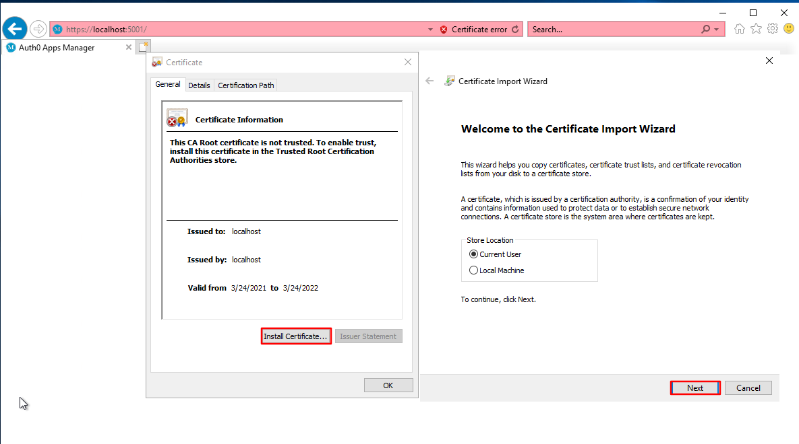

# Auth0 Apps Manager

Sample applcation to list up the applications and their assocaited rules in the Auth0 based on AntDesign Blazor.

## Screenshots


## How to setup

### Preparation
1) [Create and authorize a machine-to-machine application](https://auth0.com/docs/tokens/management-api-access-tokens/create-and-authorize-a-machine-to-machine-application) for "Auth0 Apps Manager"
to call Auth0 Management API.

2) Assign "read:clients", "read:rules" permissions for the Auth0 Management API.


3) Create another Regular Web Application with name AppsManager to authenticate/authorize your users to access the "Auth0 Apps Manager".


4) Add https://localhost:5001/callback to the *Allowed Callback URLs* and add https://localhost:5001 to the *Allowed Logout URLs*.

### Installing
1. [Download](https://dotnet.microsoft.com/download/dotnet/5.0) and Install .NET SDK 5.0 or above.
2. Download, fork, or clone the repository.
3. Open the project with your favorite IDE (VS Code, Visual Studio, Atom, etc).
4. Update Auth0 and ApiSettings section in the appsettings.json. You can get the informaiotn for ApiSettings from the application created in Preparation step 1, and Auth0 setting from the application created in Preparation step 3.
#### Auth0


#### ApiSettings


5. Run the app with your IDE or these commands:

```
$ cd /your-local-path/auth0app/src/
$ dotnet run
```
Then you can open `https://localhost:5001` with your browser.

### Secure Apps Manager Access
1. [Create a new rule](https://auth0.com/docs/rules/create-rules)
2. Update the script as below.
```js
function userWhitelistForSpecificApp(user, context, callback) {
  // Access should only be granted to verified users.
  if (!user.email || !user.email_verified) {
    return callback(new UnauthorizedError('Access denied.'));
  }

  // only enforce for AppsManager
  // bypass this rule for all other apps
  if (context.clientName !== 'AppsManager') {
    return callback(null, user, context);
  }

  const whitelist = ['liminghao0922@gmail.com']; // add authorized users here
  const userHasAccess = whitelist.some(function (email) {
    return email === user.email;
  });

  if (!userHasAccess) {
    return callback(new UnauthorizedError('Access denied.'));
  }

  callback(null, user, context);
}
```


### Troubleshooting
If you get the error like below, it is caused by we are using the self-signed certificate while running the app locally on windows. Please don't forget to add the localhost certifcate to the trusted certificated store.
```
info: AntDesign.ProLayout.BasicLayout[0]
      BasicLayout initialized.
info: AntDesign.ProLayout.BaseMenu[0]
      BaseMenu initialized.
warn: Microsoft.AspNetCore.Components.Server.Circuits.RemoteRenderer[100]
      Unhandled exception rendering component: The SSL connection could not be established, see inner exception.
      System.Net.Http.HttpRequestException: The SSL connection could not be established, see inner exception.
       ---> System.Security.Authentication.AuthenticationException: The remote certificate is invalid because of errors in the certificate chain: UntrustedRoot
         at System.Net.Security.SslStream.SendAuthResetSignal(ProtocolToken message, ExceptionDispatchInfo exception)
         at System.Net.Security.SslStream.ForceAuthenticationAsync[TIOAdapter](TIOAdapter adapter, Boolean receiveFirst, Byte[] reAuthenticationData, Boolean isApm)
         at System.Net.Http.ConnectHelper.EstablishSslConnectionAsyncCore(Boolean async, Stream stream, SslClientAuthenticationOptions sslOptions, CancellationToken cancellationToken)
         --- End of inner exception stack trace ---
         at System.Net.Http.ConnectHelper.EstablishSslConnectionAsyncCore(Boolean async, Stream stream, SslClientAuthenticationOptions sslOptions, CancellationToken cancellationToken)
         at System.Net.Http.HttpConnectionPool.ConnectAsync(HttpRequestMessage request, Boolean async, CancellationToken cancellationToken)
         at System.Net.Http.HttpConnectionPool.CreateHttp11ConnectionAsync(HttpRequestMessage request, Boolean async, CancellationToken cancellationToken)
         at System.Net.Http.HttpConnectionPool.GetHttpConnectionAsync(HttpRequestMessage request, Boolean async, CancellationToken cancellationToken)
         at System.Net.Http.HttpConnectionPool.SendWithRetryAsync(HttpRequestMessage request, Boolean async, Boolean doRequestAuth, CancellationToken cancellationToken)
         at System.Net.Http.RedirectHandler.SendAsync(HttpRequestMessage request, Boolean async, CancellationToken cancellationToken)
         at System.Net.Http.DiagnosticsHandler.SendAsyncCore(HttpRequestMessage request, Boolean async, CancellationToken cancellationToken)
         at System.Net.Http.HttpClient.SendAsyncCore(HttpRequestMessage request, HttpCompletionOption completionOption, Boolean async, Boolean emitTelemetryStartStop, CancellationToken cancellationToken)
         at System.Net.Http.Json.HttpClientJsonExtensions.GetFromJsonAsyncCore[T](Task`1 taskResponse, JsonSerializerOptions options, CancellationToken cancellationToken)
         at Auth0app.BasicLayout.OnInitializedAsync() in /Users/lgj/tmp/techexec/20210603_minghaoli/auth0app/src/Layouts/BasicLayout.razor:line 49
         at Microsoft.AspNetCore.Components.ComponentBase.RunInitAndSetParametersAsync()
         at Microsoft.AspNetCore.Components.RenderTree.Renderer.GetErrorHandledTask(Task taskToHandle)
fail: Microsoft.AspNetCore.Components.Server.Circuits.CircuitHost[111]
      Unhandled exception in circuit 'Jw3lYayQMC3JAIQ06hjvK5bXrynLr5N2F4LcBriSMBw'.
      System.Net.Http.HttpRequestException: The SSL connection could not be established, see inner exception.
       ---> System.Security.Authentication.AuthenticationException: The remote certificate is invalid because of errors in the certificate chain: UntrustedRoot
         at System.Net.Security.SslStream.SendAuthResetSignal(ProtocolToken message, ExceptionDispatchInfo exception)
         at System.Net.Security.SslStream.ForceAuthenticationAsync[TIOAdapter](TIOAdapter adapter, Boolean receiveFirst, Byte[] reAuthenticationData, Boolean isApm)
         at System.Net.Http.ConnectHelper.EstablishSslConnectionAsyncCore(Boolean async, Stream stream, SslClientAuthenticationOptions sslOptions, CancellationToken cancellationToken)
         --- End of inner exception stack trace ---
         at System.Net.Http.ConnectHelper.EstablishSslConnectionAsyncCore(Boolean async, Stream stream, SslClientAuthenticationOptions sslOptions, CancellationToken cancellationToken)
         at System.Net.Http.HttpConnectionPool.ConnectAsync(HttpRequestMessage request, Boolean async, CancellationToken cancellationToken)
         at System.Net.Http.HttpConnectionPool.CreateHttp11ConnectionAsync(HttpRequestMessage request, Boolean async, CancellationToken cancellationToken)
         at System.Net.Http.HttpConnectionPool.GetHttpConnectionAsync(HttpRequestMessage request, Boolean async, CancellationToken cancellationToken)
         at System.Net.Http.HttpConnectionPool.SendWithRetryAsync(HttpRequestMessage request, Boolean async, Boolean doRequestAuth, CancellationToken cancellationToken)
         at System.Net.Http.RedirectHandler.SendAsync(HttpRequestMessage request, Boolean async, CancellationToken cancellationToken)
         at System.Net.Http.DiagnosticsHandler.SendAsyncCore(HttpRequestMessage request, Boolean async, CancellationToken cancellationToken)
         at System.Net.Http.HttpClient.SendAsyncCore(HttpRequestMessage request, HttpCompletionOption completionOption, Boolean async, Boolean emitTelemetryStartStop, CancellationToken cancellationToken)
         at System.Net.Http.Json.HttpClientJsonExtensions.GetFromJsonAsyncCore[T](Task`1 taskResponse, JsonSerializerOptions options, CancellationToken cancellationToken)
         at Auth0app.BasicLayout.OnInitializedAsync() in /Users/lgj/tmp/techexec/20210603_minghaoli/auth0app/src/Layouts/BasicLayout.razor:line 49
         at Microsoft.AspNetCore.Components.ComponentBase.RunInitAndSetParametersAsync()
         at Microsoft.AspNetCore.Components.RenderTree.Renderer.GetErrorHandledTask(Task taskToHandle)
```
This can be done by the following steps.
1. Open the web from Inter Explorer.
2. Click the "Certificate error" from the address bar and select "View Certificates" button.

3. Click "Install Certificate..." button. Then click Next.

4. Select the "Place all certification in the following store". Then click "Browse...".
5. Select "Trusted Root Certification Authorities" and click OK.

6. Click Next, then Finish.
7. Click Yes if a Security Warning windows is popped-up.
